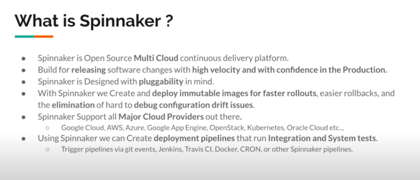
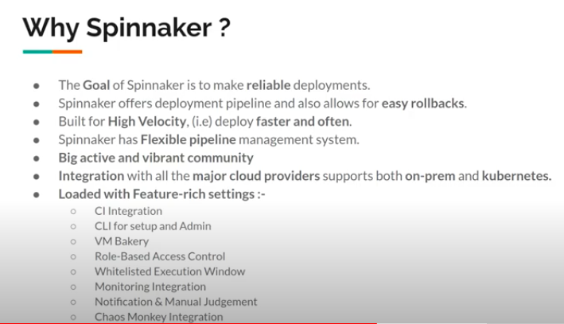
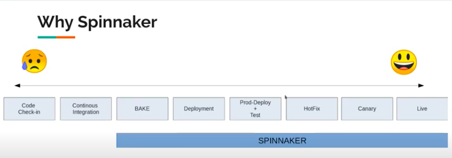
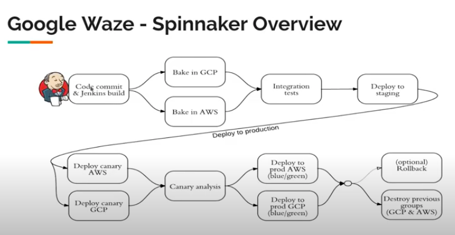

# spinnaker

Spinnaker is an open-source, multi-cloud continuous delivery platform that helps you release software changes with high velocity and confidence.

## info about Spinnaker 

<ol>
  <li>Started By Netflix in 2014 </li>
  <li>OpenSourced in November 2015  </li>
  <li> Backed by Netflix , Google , Microsoft etc ..</li>
</ol>

### What is Spinnaker 

### Reasons for using spinnaker 

### stage in deployment which is gonna be best fit to use spinnaker 

### one of the implementations 

