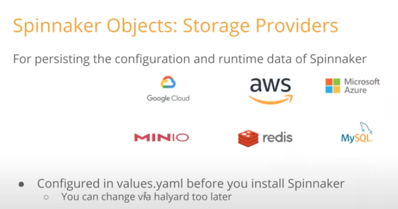
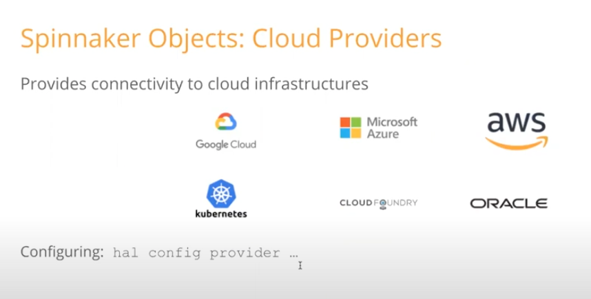
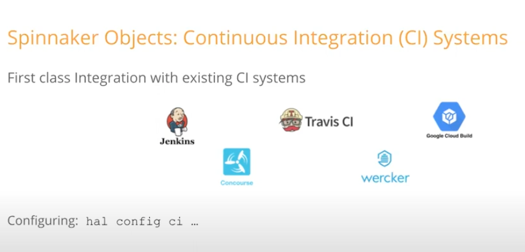
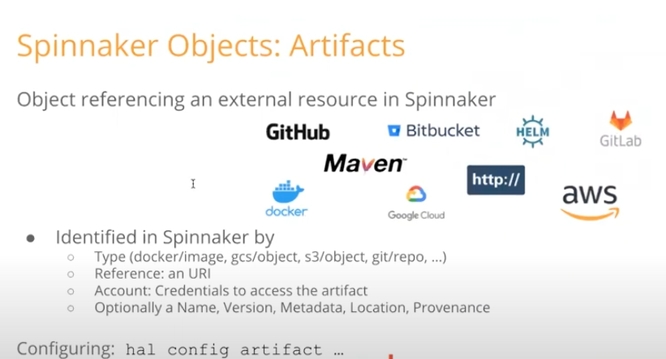
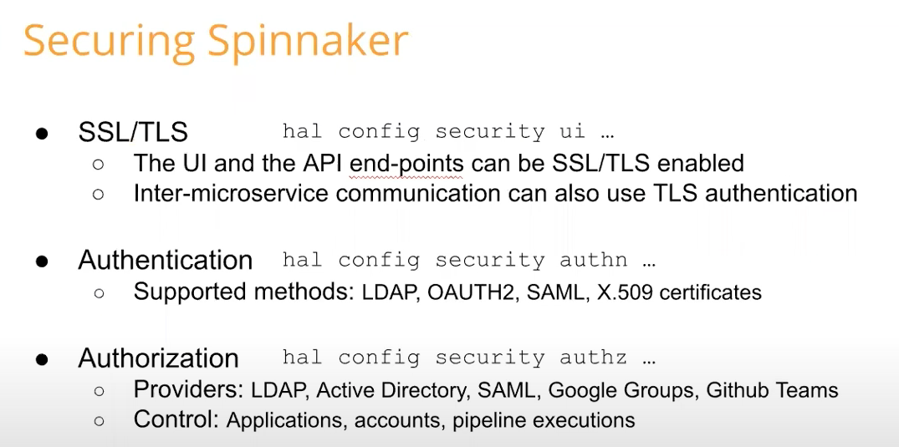

# Architecture 

## major components are listed below 

### Connections and workflow of components 

### system dependencies of Spinnaker

### some important port numbers 

## Some Important Points to Remember 

### Spinnaker Object storage  provider 

### Spinnaker object cloud providers 

### Spinnaker Object CI providers 

### spinnaker Object artifacts 

### Securing spinnaker 

