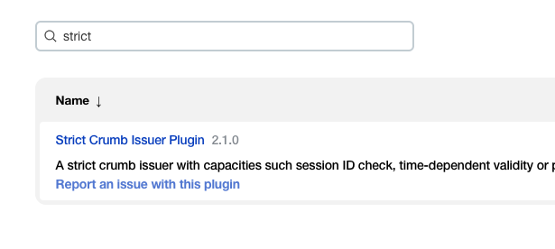
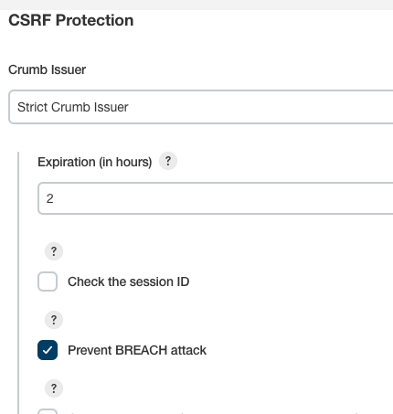

## Jenkins Integration 

### make sure halyard service is running 

```
sudo systemctl status halyard
```

### Enable CI config

```
spinnaker@ip-172-31-23-80:~$ hal config ci jenkins enable 
+ Get current deployment
  Success
+ Edit jenkins settings
  Success
+ Successfully enabled jenkins

```

### add details of jenkins 

```
spinnaker@ip-172-31-23-80:~$ hal config ci jenkins master  add  aws-jenkins --address  http://54.210.210.201:8080  --username admin  --password
The password of the jenkins user to authenticate as.: 
+ Get current deployment
  Success
+ Add the aws-jenkins master
  Success
+ Added aws-jenkins for jenkins.
```

###  enable security standard 

```
spinnaker@ip-172-31-23-80:~$ hal config ci jenkins master edit aws-jenkins --csrf true 
+ Get current deployment
  Success
+ Get the aws-jenkins master
  Success
+ Edit the aws-jenkins master
  Success
+ Edited aws-jenkins for jenkins.
```

### apply the changes 

```
sudo hal deploy apply 
```


## To trigger job on spinnaker using jenkins 

### we need to Install a plugin in jenkins 



### making changes in global security config -- 




